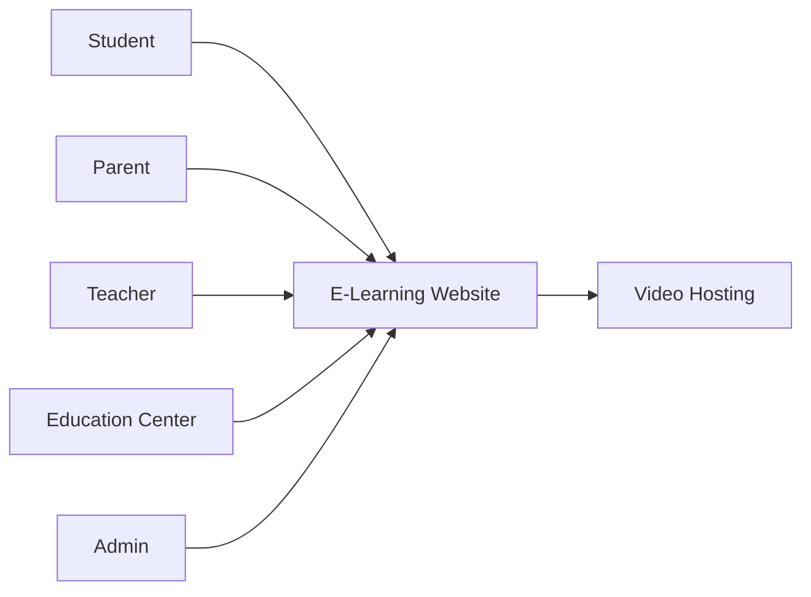
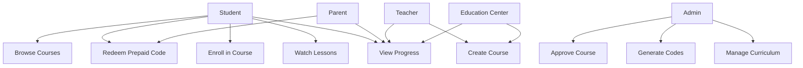
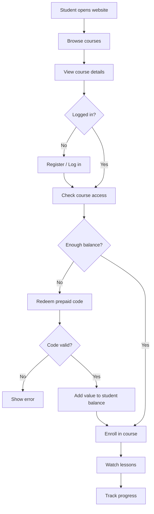
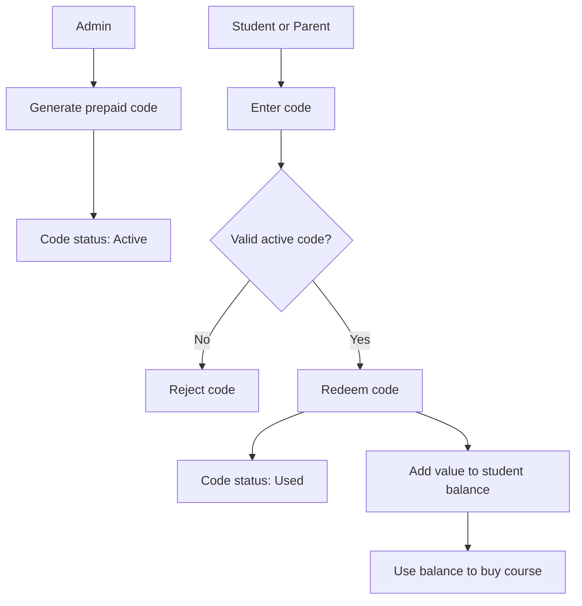
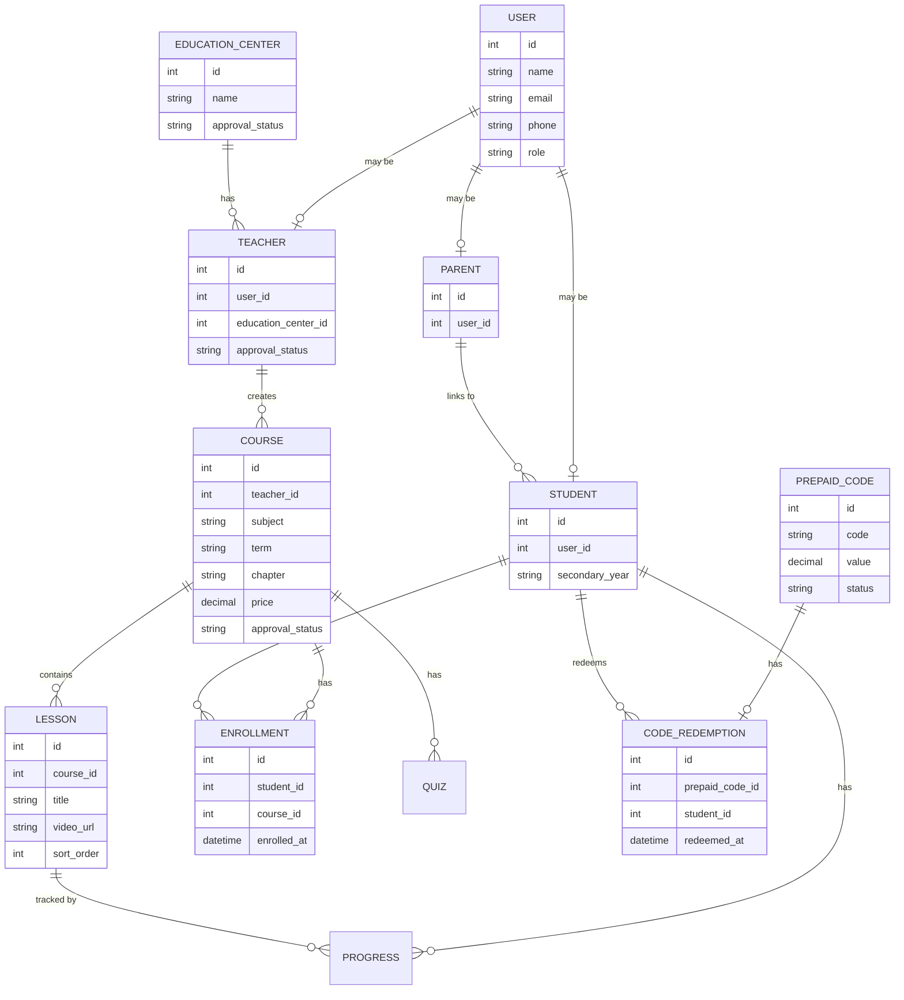

# E-Learning Website - Basic Diagrams

## 1. Purpose

This document contains simple diagrams to help the software team understand the MVP.

## 2. System Context Diagram

## 3. Use Case Diagram

## 4. Student Course Purchase Flow

## 5. Prepaid Code Flow

## 6. Simple ERD

## 7. Notes

These diagrams are basic and can be updated later when the requirements become more detailed.
