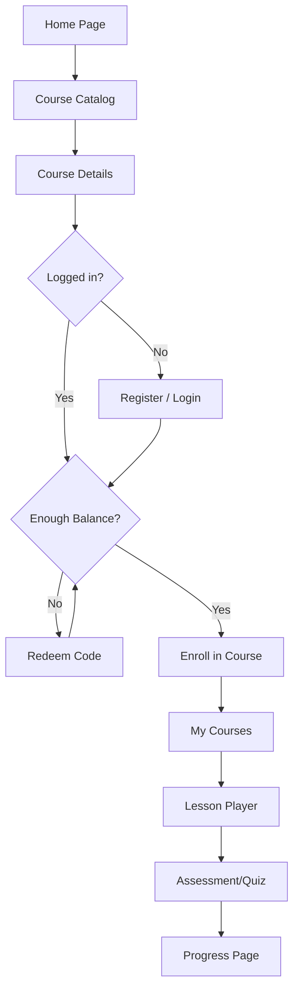
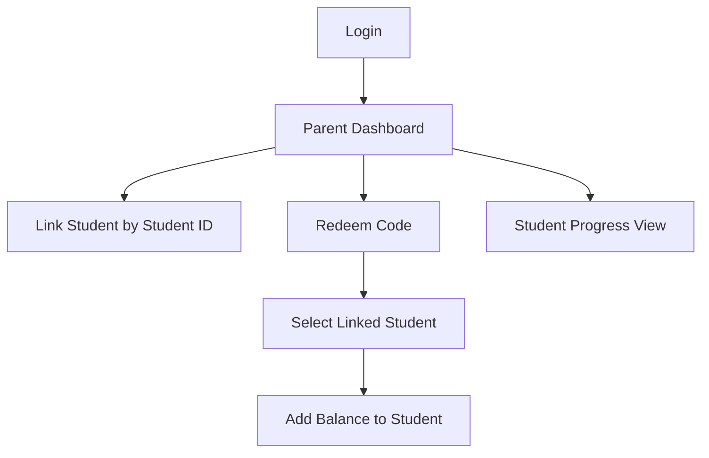
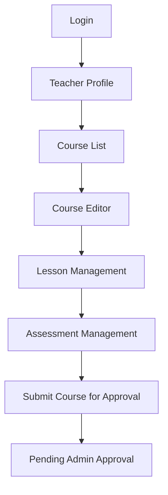
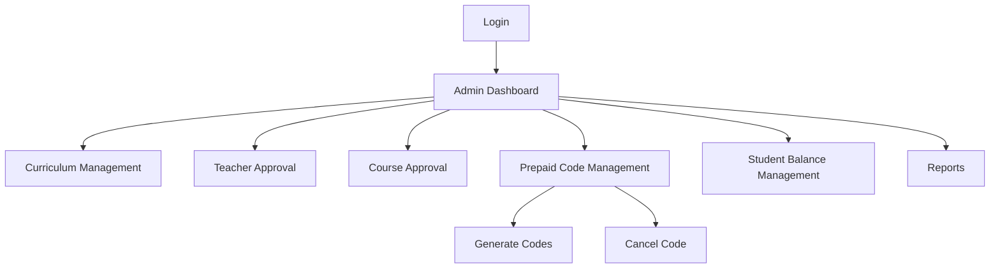

# E-Learning Website - UI Flow Map

## 1. Purpose

This document shows how users move between the main MVP screens.

## 2. Student Flow

## 3. Parent Flow

## 4. Teacher Flow

## 5. Admin Flow

## 6. Story Reference Notes

- Student flow mainly supports US-CM-06, US-EM-01, US-EM-03, US-CM-07, US-AM-05, and US-SM-03.
- Parent flow mainly supports US-SM-04, US-AM-07, and US-GM-07.
- Teacher flow mainly supports US-TM-01, US-CM-01 to US-CM-05, and US-AM-01 to US-AM-04.
- Admin flow mainly supports US-IM-04, US-TM-03, US-TM-04, US-CM-05, Module 08 prepaid stories to add, and Module 11 report stories to add.

## 7. Notes

- These flows are MVP-level flows.
- Detailed wireframes can be created from these flows later.
