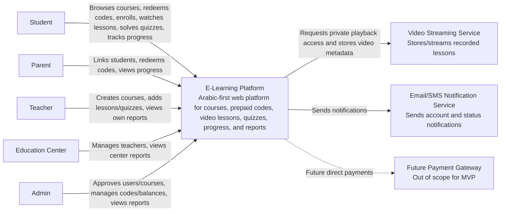

# Step 02 - System Context Diagram

## 1. Purpose

The System Context Diagram is the first C4 architecture diagram.

It answers:

- What is the system?
- Who uses it?
- What external systems does it depend on?
- What is inside the system boundary and what is outside?

At this level, we do not show databases, APIs, modules, classes, or deployment details.

## 2. System Under Design

### System Name

E-Learning Platform

### Short Description

An Arabic-first web platform for Egyptian secondary school students to buy teacher courses using prepaid codes, watch recorded lessons, solve MCQ quizzes, and track progress.

The platform also supports parents, teachers, education centers, and admins.

## 3. Human Actors

### Student

Main goals:

- Register and log in
- Browse courses
- Redeem prepaid codes
- Enroll in courses
- Watch lessons
- Solve quizzes
- Track own progress

### Parent

Main goals:

- Register and log in
- Link to student accounts
- Redeem prepaid codes for linked students
- View linked student enrollments and progress

### Teacher

Main goals:

- Manage profile
- Create draft courses
- Add lessons, videos, and quizzes
- Submit courses for admin approval
- View enrolled students and course progress reports

### Education Center

Main goals:

- Manage center profile
- Create teacher accounts
- Manage linked teachers
- View reports for center teachers and courses

### Admin

Main goals:

- Manage users
- Approve teachers and education centers
- Approve or reject courses
- Manage curriculum data
- Generate and manage prepaid codes
- Adjust student balances
- View platform reports
- Review important admin actions

## 4. External Systems

### Video Streaming Service

Purpose:

- Store or stream recorded lesson videos.
- Provide stable video playback.
- Help prevent permanent public video URLs.

Important note:

The application should store video metadata, but the actual video delivery should not go through the application backend.

### Email/SMS Notification Service

Purpose:

- Send account, approval, code, or important status notifications.

MVP status:

Not clearly required in the current MVP documentation, but likely needed soon.

### Future Payment Gateway

Purpose:

- Support direct card or wallet payments in a later phase.

MVP status:

Out of scope. The MVP uses prepaid codes only.

## 5. System Boundary

### Inside the E-Learning Platform

- User accounts and roles
- Parent-student linking
- Teacher and education center approval
- Curriculum structure
- Course catalog
- Course and lesson management
- Quiz management
- Enrollment
- Progress tracking
- Prepaid code and balance management
- Reports
- Audit logs
- Video metadata and video access control

### Outside the E-Learning Platform

- Actual video file storage and streaming
- Email/SMS delivery
- Future external payment processing

## 6. C4 System Context Diagram

## 7. Context-Level Responsibilities

At the context level, the E-Learning Platform is responsible for:

- Knowing who the user is
- Knowing what role the user has
- Knowing what data the user can access
- Managing courses, enrollments, quizzes, progress, prepaid codes, and reports
- Coordinating with the video service for video playback
- Recording sensitive operations for auditability

The E-Learning Platform is not responsible for:

- Streaming large video files directly from the backend
- Handling direct card/wallet payments in MVP
- Replacing the video provider's DRM or advanced anti-download features

## 8. Key Context Decisions

### Decision 1 - Video is External

The actual video streaming service is outside the system boundary.

Reason:

Video files are heavy, need stable playback, and should not overload the application backend.

Architecture impact:

- The platform stores video metadata.
- The platform controls who can request video playback access.
- The video provider handles actual streaming.

### Decision 2 - Payment Gateway is Future, Not MVP

The MVP does not integrate with a direct payment gateway.

Reason:

The product documentation says payment is done using prepaid codes only.

Architecture impact:

- The first design focuses on prepaid code, balance, and enrollment transactions.
- Payment integration should remain possible later, but should not complicate MVP design now.

### Decision 3 - Authorization is Central

Many actors interact with the same system but with different permissions.

Reason:

Students, parents, teachers, centers, and admins all see different parts of the system.

Architecture impact:

- The backend must enforce authorization, not only the frontend.
- Access checks must include role, ownership, enrollment, parent-student link, teacher ownership, and center relationship.

## 9. Main Context Risks

| Risk | Why It Matters | Early Design Response |
| --- | --- | --- |
| Student accesses unpaid course content. | Causes revenue leakage and trust issues. | Backend checks enrollment before lesson, quiz, and video access. |
| Parent sees unlinked student data. | Privacy issue. | Parent-student link required for progress access. |
| Teacher sees another teacher's reports. | Privacy and business issue. | Report queries scoped by teacher ownership. |
| Center sees unrelated teacher data. | Privacy and business issue. | Report queries scoped by center-teacher relationship. |
| Public video links are shared. | Paid content can leak. | Use private video access with expiring URLs or provider tokens. |
| Future payment integration changes core design. | MVP may become hard to extend. | Keep prepaid code/balance as a payment method concept, not a one-off hack. |

## 10. Architect Notes

At this step, do not design database tables yet.

The goal is to make the system boundary clear:

- People use the E-Learning Platform.
- The E-Learning Platform owns business rules.
- External providers handle specialized technical capabilities such as video delivery and notifications.

This diagram is intentionally simple. A good context diagram should be understandable by business stakeholders, not only engineers.

## 11. Step 02 Conclusion

The E-Learning Platform is the central system that owns learning, enrollment, prepaid codes, balance, permissions, progress, and reports.

The most important external dependency is the Video Streaming Service.

The next step is the Container Diagram, where we break the platform into major deployable or runtime parts such as web frontend, backend API, database, cache, and external services.

