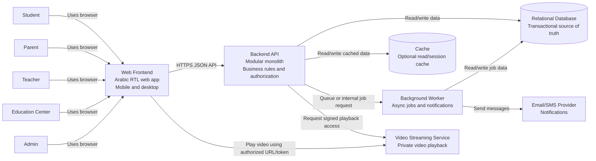

# Step 03 - Container Diagram

## 1. Purpose

The Container Diagram is the second C4 architecture diagram.

It answers:

- What major applications and data stores make up the system?
- How do they communicate?
- Which responsibilities belong to each container?
- Which external services are used at runtime?

In C4, a "container" does not mean Docker only. It means a separately running application, process, data store, or major runtime unit.

## 2. Containers

### Web Frontend

Type:

Browser-based web application.

Main users:

- Student
- Parent
- Teacher
- Education Center
- Admin

Responsibilities:

- Arabic RTL user interface
- Mobile and desktop screens
- Login/register screens
- Course browsing
- Course management UI
- Video lesson player page
- Quiz screens
- Parent progress view
- Admin dashboard
- Teacher and center dashboards

Important note:

The frontend must not enforce business rules alone. It can hide buttons and improve UX, but the backend must still validate permissions and rules.

### Backend API

Type:

Server-side application.

Responsibilities:

- Authentication and session/token handling
- Role and permission checks
- User, teacher, parent, center, and admin operations
- Course catalog and course management
- Enrollment and paid access control
- Prepaid code redemption
- Student balance operations
- Quiz submission and scoring
- Progress tracking
- Reports
- Audit logging
- Video access authorization

Recommended style:

Modular Monolith with Clean Architecture boundaries.

### Relational Database

Type:

Primary transactional database.

Responsibilities:

- Store users and roles
- Store parent-student links
- Store teacher-center relationships
- Store curriculum structure
- Store courses, lessons, and quizzes
- Store enrollments
- Store prepaid codes
- Store balance ledger and current balance
- Store progress and quiz attempts
- Store audit logs
- Support reports

Why relational:

The MVP has strong relationships, transactions, money-like operations, and reporting needs.

### Cache

Type:

Optional cache, such as Redis.

Responsibilities:

- Cache frequently-read catalog data
- Cache curriculum lookup data
- Cache short-lived authorization/session data if needed
- Reduce repeated database reads for common public browsing flows

MVP note:

Cache is useful but should not be required for correctness. The database remains the source of truth.

### Background Worker

Type:

Separate server-side process or hosted worker.

Responsibilities:

- Send notifications
- Generate heavy reports if needed
- Process non-critical async tasks
- Clean up temporary records if needed

MVP note:

The worker can be added when async jobs become necessary. Do not move prepaid redemption or enrollment purchase into an unreliable async flow.

### Video Streaming Service

Type:

External video provider or CDN.

Responsibilities:

- Store or stream recorded lesson videos
- Provide stable playback
- Support private video access using signed URLs, tokens, or provider permissions

Important boundary:

The platform backend decides whether a student can access a video. The video provider delivers the video.

### Email/SMS Notification Service

Type:

External provider.

Responsibilities:

- Send account, approval, or status notifications

MVP note:

This is likely useful, but the current MVP documentation does not make it a core requirement.

## 3. C4 Container Diagram



## 4. Main Runtime Flows

### Browse Courses

```text
Student -> Web Frontend -> Backend API -> Database/Cache -> Backend API -> Web Frontend
```

Notes:

- Course catalog is read-heavy.
- Approved and published courses only should be visible.
- Filters should use indexed columns such as year, subject, term, chapter, and teacher.

### Redeem Prepaid Code

```text
Student/Parent -> Web Frontend -> Backend API -> Relational Database transaction
```

Transaction should:

- Validate code exists.
- Validate code is active.
- Validate code was not used before.
- Mark code as used.
- Add value to student balance.
- Insert balance ledger entry.
- Insert redemption history.

This flow must not depend on cache or async workers for correctness.

### Enroll in Course

```text
Student -> Web Frontend -> Backend API -> Relational Database transaction
```

Transaction should:

- Validate course is approved and published.
- Validate student is not already enrolled.
- Validate student has enough balance.
- Deduct balance.
- Insert balance ledger entry.
- Create enrollment.

### Watch Video Lesson

```text
Student -> Web Frontend -> Backend API -> Database -> Video Streaming Service -> Web Frontend
```

Backend should:

- Validate student is authenticated.
- Validate student is enrolled in the course.
- Validate course and lesson are available.
- Request or generate private playback access.
- Return a short-lived video playback URL/token.

Frontend should:

- Use the authorized playback URL/token.
- Send progress events to the backend.

### Submit Quiz

```text
Student -> Web Frontend -> Backend API -> Relational Database
```

Backend should:

- Validate enrollment.
- Validate quiz belongs to the course.
- Validate student has no previous attempt for this quiz in MVP.
- Score answers.
- Store quiz attempt and result.
- Update progress if quiz result affects progress.

## 5. Container Responsibilities and Rules

| Container | Owns | Must Not Own |
| --- | --- | --- |
| Web Frontend | UI state, forms, navigation, user experience | Final authorization, payment/balance correctness, quiz retry enforcement |
| Backend API | Business rules, authorization, transactions, API contracts | Large video file streaming |
| Relational Database | Durable source of truth and transactional consistency | UI behavior |
| Cache | Fast repeated reads | Source of truth for balance, enrollment, code redemption, or quiz attempts |
| Background Worker | Async/non-critical jobs | Critical purchase/redemption correctness |
| Video Service | Video storage and playback | Business decision of who can access a course |
| Notification Provider | Message delivery | Business event ownership |

## 6. Important Architecture Decisions

### Decision 1 - Backend API Owns Authorization

Reason:

The frontend is easy to bypass. Any user can call APIs directly.

Impact:

Every sensitive endpoint must check role and relationship:

- Student enrollment for lesson/video/quiz access
- Parent-student link for parent views
- Teacher ownership for teacher reports
- Center-teacher relationship for center reports
- Admin role for approvals, codes, balances, and platform settings

### Decision 2 - Database is Source of Truth

Reason:

Prepaid codes, student balance, enrollment, quiz attempts, and progress must be correct.

Impact:

- Cache can improve speed but cannot decide correctness.
- Transactions protect money-like operations.
- Unique constraints protect against duplicate redemption, duplicate enrollment, and duplicate quiz attempts.

### Decision 3 - Video Streaming is External

Reason:

Video is bandwidth-heavy and needs specialized delivery.

Impact:

- Backend stores metadata.
- Video provider stores/streams actual videos.
- Backend issues or requests authorized playback access only after checking enrollment.

### Decision 4 - Background Worker is for Non-Critical Async Work

Reason:

Async jobs can fail or be delayed.

Impact:

- Do not make prepaid code redemption eventually consistent.
- Do not make course enrollment eventually consistent in MVP.
- Use workers for notifications, reports, and non-critical tasks.

## 7. Suggested Technology-Agnostic Shape

This design does not require a specific programming language.

One reasonable stack could be:

- Web Frontend: React, Angular, Vue, or server-rendered web UI
- Backend API: .NET, Java/Spring, Node.js, Python/Django, or similar
- Database: PostgreSQL, SQL Server, or MySQL
- Cache: Redis
- Video: Vimeo, Cloudflare Stream, AWS CloudFront/S3 with signed URLs, or similar
- Notifications: SMS/email provider

Architecture first, technology second.

## 8. Risks at Container Level

| Risk | Design Response |
| --- | --- |
| Backend becomes a big ball of mud. | Keep clear internal modules and boundaries. |
| Cache returns stale access data. | Do not rely on cache for sensitive access decisions unless carefully invalidated. |
| Video URLs are shared. | Use short-lived signed URLs or provider tokens. |
| Redemption race condition. | Use database transaction and unique constraints. |
| Enrollment race condition. | Use transaction and balance concurrency control. |
| Reports slow down transactional APIs. | Add indexes first; later move heavy reports to worker/read model if needed. |

## 9. Step 03 Conclusion

The system should start with these main containers:

1. Web Frontend
2. Backend API
3. Relational Database
4. Optional Cache
5. Optional Background Worker
6. External Video Streaming Service
7. External Notification Provider

The Backend API is the center of business rules and authorization.

The Relational Database is the source of truth.

The next C4 step is the Component Diagram, where we zoom into the Backend API and design its internal modules.

