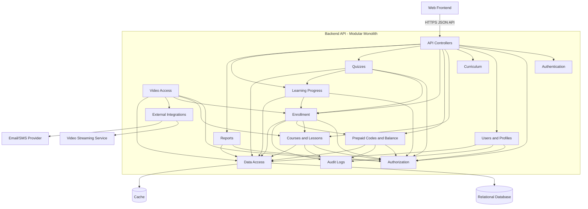

# Step 04 - Component Diagram: Backend API

## 1. Purpose

The Component Diagram is the third C4 architecture diagram.

It zooms into one container and answers:

- What major components exist inside the container?
- What responsibility does each component have?
- How do components collaborate?
- Where should business rules live?

This document zooms into the Backend API container.

## 2. Container Under Design

### Backend API

The Backend API is the server-side application responsible for:

- Authentication and authorization
- Business rules
- Transactions
- Data validation
- API contracts
- Integration with database, cache, video provider, and notification provider

Recommended internal style:

Modular Monolith with Clean Architecture boundaries.

## 3. Backend API Components

### API Controllers

Responsibilities:

- Receive HTTP requests from the Web Frontend
- Validate request shape
- Call application use cases
- Return HTTP responses

Should not contain:

- Core business rules
- SQL queries
- Balance calculations
- Authorization logic beyond endpoint-level policies

### Authentication Component

Responsibilities:

- Login
- Logout
- Token/session validation
- Password handling
- Current user identity

### Authorization Component

Responsibilities:

- Role-based access checks
- Relationship-based access checks
- Enrollment checks
- Parent-student link checks
- Teacher ownership checks
- Center-teacher relationship checks
- Admin permission checks

Important:

Authorization must be enforced in the backend, not only in the frontend.

### User and Profile Component

Responsibilities:

- Student accounts
- Parent accounts
- Teacher profile data
- Education center profile data
- Admin user management
- Teacher approval profile data

### Curriculum Component

Responsibilities:

- Secondary years
- Subjects
- Terms
- Chapters
- Curriculum lookup data used for course organization

### Course Component

Responsibilities:

- Course drafts
- Course details
- Course pricing
- Course approval status
- Published course catalog
- Lesson metadata
- Course visibility rules

### Video Access Component

Responsibilities:

- Store video metadata
- Validate lesson video access
- Request or generate signed video playback access
- Prevent permanent public video exposure

Important:

This component does not stream video bytes. The external video service does that.

### Prepaid Code and Balance Component

Responsibilities:

- Prepaid code generation
- Code status management
- Code redemption
- Student balance
- Balance ledger
- Manual admin balance adjustments
- Refund support through manual balance reset

Important:

This component is one of the highest-risk areas because it handles money-like operations.

### Enrollment Component

Responsibilities:

- Course purchase using student balance
- Enrollment creation
- Enrollment status
- Access eligibility for paid courses

Important:

Enrollment creation and balance deduction should happen in one database transaction.

### Quiz Component

Responsibilities:

- MCQ quiz definition
- Quiz answer submission
- Quiz scoring
- Quiz attempt storage
- No-retry rule for MVP

### Progress Component

Responsibilities:

- Lesson progress
- Manual lesson completion
- Automatic completion after watching 90% of video
- Course progress calculation
- Progress data used by students, parents, teachers, centers, and admins

### Reports Component

Responsibilities:

- Admin enrollment reports
- Admin prepaid code reports
- Admin teacher sales reports
- Admin student progress reports
- Teacher own-course reports
- Education center reports for linked teachers/courses

Important:

Reports must respect authorization boundaries.

### Audit Log Component

Responsibilities:

- Record important admin actions
- Record sensitive balance/code actions
- Store actor, action, target, timestamp, and relevant metadata

Examples:

- Teacher approval
- Course approval
- Prepaid code generation
- Prepaid code cancellation
- Manual balance adjustment
- User status changes

### Data Access Component

Responsibilities:

- Database access
- Transactions
- Repository/query abstractions, if used
- Unit of Work, if used by the stack

Important:

The database is the source of truth. Data access should support reliable transactions for sensitive flows.

### Integration Components

Responsibilities:

- Video provider API client
- Notification provider API client
- Future payment provider API client

## 4. C4 Component Diagram



## 5. Component Rules

### Rule 1 - Controllers Stay Thin

Controllers should handle transport concerns:

- Parse request
- Validate basic input shape
- Call use case/service
- Return response

They should not directly implement:

- Code redemption logic
- Balance deduction
- Course access decisions
- Quiz scoring rules
- Report scoping rules

### Rule 2 - Business Rules Live in Application/Domain Components

Examples:

- A used prepaid code cannot be redeemed again.
- Student balance cannot become negative.
- A student cannot watch lessons without enrollment.
- A course cannot be published without admin approval.
- A quiz cannot be retried in MVP.

These rules must be tested without needing the UI.

### Rule 3 - Authorization is Explicit

Authorization cannot be an afterthought because many roles share the system.

Important checks:

- Student can access own enrollments and progress.
- Parent can access only linked students.
- Teacher can access only own courses.
- Center can access only linked teacher/course data.
- Admin can manage platform-level data.
- Course content access requires enrollment and published course status.

### Rule 4 - Sensitive Flows Use Transactions

The following flows need database transactions:

- Redeem prepaid code
- Add prepaid value to student balance
- Enroll in course and deduct balance
- Submit quiz and store attempt/progress impact
- Admin manual balance adjustment

### Rule 5 - Cache Cannot Own Correctness

Cache can speed up:

- Course catalog
- Curriculum lookup data
- Public course details

Cache should not be the source of truth for:

- Student balance
- Prepaid code status
- Enrollment access
- Quiz attempts
- Parent-student links
- Admin audit logs

## 6. Main Use Case Collaborations

### Use Case 1 - Redeem Prepaid Code

Components:

- API Controllers
- Authentication
- Authorization
- Prepaid Codes and Balance
- Audit Logs
- Data Access
- Relational Database

Flow:

```text
1. Student or parent submits prepaid code.
2. Controller calls RedeemCode use case.
3. Authorization checks the student target.
4. Prepaid Code component validates code status.
5. Transaction starts.
6. Code is marked as used.
7. Student balance is increased.
8. Balance ledger record is inserted.
9. Redemption history is inserted.
10. Audit log is written if needed.
11. Transaction commits.
```

### Use Case 2 - Enroll in Course

Components:

- API Controllers
- Authorization
- Enrollment
- Courses
- Prepaid Codes and Balance
- Audit Logs
- Data Access
- Relational Database

Flow:

```text
1. Student requests course enrollment.
2. Authorization confirms the user is a student.
3. Course component confirms course is approved and published.
4. Enrollment component checks student is not already enrolled.
5. Balance component checks available balance.
6. Transaction starts.
7. Student balance is deducted.
8. Balance ledger entry is inserted.
9. Enrollment record is created.
10. Transaction commits.
```

### Use Case 3 - Watch Video Lesson

Components:

- API Controllers
- Authorization
- Video Access
- Courses
- Enrollment
- External Integrations
- Video Streaming Service

Flow:

```text
1. Student opens lesson page.
2. Frontend requests playback access.
3. Authorization checks authenticated student.
4. Video Access checks lesson belongs to an approved course.
5. Enrollment confirms student is enrolled.
6. Video provider client creates or requests short-lived playback access.
7. Backend returns playback token or signed URL.
8. Frontend plays video from video provider.
```

### Use Case 4 - Submit Quiz

Components:

- API Controllers
- Authorization
- Quizzes
- Enrollment
- Progress
- Data Access
- Relational Database

Flow:

```text
1. Student submits quiz answers.
2. Authorization checks enrollment.
3. Quiz component checks quiz belongs to course.
4. Quiz component checks no previous attempt exists for MVP.
5. Quiz component scores answers.
6. Transaction starts.
7. Quiz attempt is stored.
8. Progress is updated if quiz affects progress.
9. Transaction commits.
```

## 7. Suggested Internal Module Boundaries

For implementation, keep these modules separate:

```text
Identity
Users
Curriculum
Courses
Video
PrepaidCodes
Balance
Enrollment
Quizzes
Progress
Reports
Audit
```

Some modules may share the same database, but they should not freely modify each other's data without clear use cases.

Example:

- Enrollment may call Balance to deduct balance.
- Quiz may call Progress to update progress.
- Video may call Enrollment to check access.

## 8. Component-Level Risks

| Risk | Why It Happens | Design Response |
| --- | --- | --- |
| Controllers become too large. | Developers put business logic in endpoints. | Use application use cases/services. |
| Authorization is duplicated inconsistently. | Each component writes its own checks casually. | Centralize common authorization policies. |
| Balance logic is scattered. | Course enrollment and admin screens both update balance directly. | Balance component owns all balance changes. |
| Reports leak data. | Report filters forget teacher/center scope. | Reports must call Authorization/scoping policies. |
| Quiz retry rule is frontend-only. | User can call API directly. | Enforce unique attempt rule in backend/database. |
| Video access links are too long-lived. | Signed URLs are configured poorly. | Use short expiration and provider permissions. |

## 9. Step 04 Conclusion

The Backend API should be organized around business components, not only technical layers.

The most important components to design carefully are:

1. Authorization
2. Prepaid Codes and Balance
3. Enrollment
4. Video Access
5. Progress and Quizzes
6. Reports
7. Audit Logs

The next C4 step is the Code Diagram. In practice, architects often create code diagrams only for complex or risky parts. For this project, the best candidate is the prepaid code redemption and enrollment purchase flow because it contains money-like operations and transaction rules.

