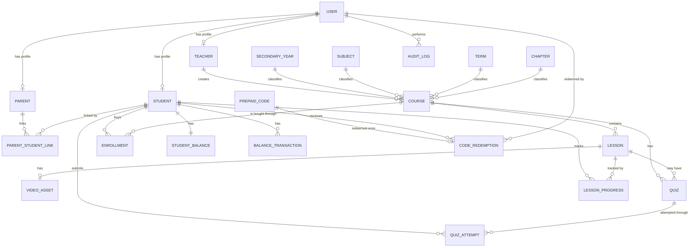

# Step 06 - Domain Model and Database Design

## 1. Purpose

This step moves from diagrams into domain modeling and database design.

It answers:

- What are the main business areas?
- What entities does each area own?
- What relationships exist between entities?
- Which rules should be protected by the database?
- What is a good first relational schema for the MVP?

This is still architecture-level design, not final migration scripts.

## 2. Recommended Domain Areas

For the MVP, divide the domain into these system modules:

1. Identity & Access Management
2. Teacher Management
3. Student Management
4. Content & Course Management
5. Enrollment Management
6. Assessment Management
7. Grading Management
8. Payment & Subscription Management
9. Notification Management
10. Parent Portal
11. Reporting & Analytics
12. Administration

In a modular monolith, these areas can live in the same backend application and same database, but they should have clear ownership.

## 3. Core Entity Map



## 4. Entity Responsibilities

### User

Represents login identity.

Important fields:

- Id
- Name
- Phone
- Email
- PasswordHash
- Role
- Status
- CreatedAt
- UpdatedAt

Notes:

- `Role` can be `Student`, `Parent`, `Teacher`, or `Admin`.
- If the product later needs users with multiple roles, replace single `Role` with `UserRoles`.

### Student

Represents student-specific profile data.

Important fields:

- Id
- UserId
- PublicStudentCode or StudentNumber
- SecondaryYearId
- CreatedAt

Rules:

- Student can register without parent approval.
- Student can enroll in many courses.
- Student has one balance.

### Parent

Represents parent-specific profile data.

Important fields:

- Id
- UserId
- CreatedAt

Rules:

- Parent can link to one or more students.
- Parent can view only linked student progress.
- Parent can redeem prepaid codes for one linked student at a time.

### ParentStudentLink

Represents parent-to-student access.

Important fields:

- Id
- ParentId
- StudentId
- CreatedAt

Rules:

- Parent links to student using student ID.
- MVP does not require student approval.
- Add a unique constraint on `ParentId + StudentId`.

### Teacher

Represents teacher-specific profile and approval data.

Important fields:

- Id
- UserId
- SubjectId
- Bio
- ProfileImageUrl
- ApprovalStatus
- ApprovedByUserId nullable
- ApprovedAt nullable
- CreatedAt

Rules:

- Teachers are individual users in MVP.
- Teacher approval requires name, phone, subject, bio, profile image, and documents.
- Teacher creates many courses.

### Curriculum Entities

Entities:

- SecondaryYear
- Subject
- Term
- Chapter

Rules:

- Courses must follow year, subject, term, and chapter.
- Admin manages curriculum data.

### Course

Represents a teacher course.

Important fields:

- Id
- TeacherId
- SecondaryYearId
- SubjectId
- TermId
- ChapterId
- Title
- Description
- Price
- ApprovalStatus
- PublicationStatus
- ApprovedByUserId nullable
- ApprovedAt nullable
- CreatedAt
- UpdatedAt

Rules:

- Course belongs to one main teacher.
- Teacher sets course price.
- Admin can edit teacher course prices.
- Course is hidden until admin approval.
- Student buys teacher courses separately.

### Lesson

Represents one lesson inside a course.

Important fields:

- Id
- CourseId
- Title
- SortOrder
- VideoAssetId nullable
- CreatedAt

Rules:

- One course has many lessons.
- Lessons are accessible only through enrolled, published courses.

### VideoAsset

Represents video metadata, not the video file itself.

Important fields:

- Id
- Provider
- ProviderAssetId
- DurationSeconds
- Status
- CreatedAt

Rules:

- Actual video streaming is external.
- Do not store permanent public URLs.
- Playback access should be short-lived and authorization-based.

### PrepaidCode

Represents a code generated by admin.

Important fields:

- Id
- Code
- SerialNumber
- Value
- Status
- GeneratedByUserId
- CancelledByUserId nullable
- CancelledAt nullable
- CreatedAt

Rules:

- Code has fixed value.
- Code status can be active, used, or cancelled.
- Prepaid codes do not expire.
- Code has serial number for manual distribution tracking.
- Used or cancelled code cannot be redeemed.

### CodeRedemption

Represents successful code redemption.

Important fields:

- Id
- PrepaidCodeId
- StudentId
- RedeemedByUserId
- RedeemedAt

Rules:

- Each prepaid code can have one redemption only.
- A code can be redeemed for one student only.

### StudentBalance

Represents current balance for a student.

Important fields:

- Id
- StudentId
- CurrentAmount
- Version or RowVersion
- UpdatedAt

Rules:

- One student has one balance.
- Current amount cannot become negative.
- Balance should only change through balance operations.

### BalanceTransaction

Represents immutable balance history.

Important fields:

- Id
- StudentId
- Amount
- Type
- Reason
- ReferenceType
- ReferenceId nullable
- CreatedByUserId
- CreatedAt

Rules:

- Every balance change creates a transaction.
- Positive transactions add balance.
- Negative transactions deduct balance.
- Admin manual adjustments should include reason.

### Enrollment

Represents student access to a purchased course.

Important fields:

- Id
- StudentId
- CourseId
- PurchaseAmount
- EnrolledAt
- Status

Rules:

- Student can enroll in many courses.
- Student cannot enroll in the same course twice.
- Student cannot enroll in unpublished courses.
- Enrollment and balance deduction should happen in one transaction.

### Quiz

Represents an assessment/quiz.

Important fields:

- Id
- CourseId
- LessonId nullable
- Title
- CreatedAt

Rules:

- Assessment question types follow the Assessment Management module scope.
- Quiz can be linked to course or lesson.

### QuizQuestion

Important fields:

- Id
- QuizId
- QuestionText
- SortOrder

### QuizAnswerOption

Important fields:

- Id
- QuestionId
- AnswerText
- IsCorrect
- SortOrder

Rules:

- For MVP, each question should have one correct answer unless the product later supports multiple answers.

### QuizAttempt

Represents a student's submitted quiz result.

Important fields:

- Id
- QuizId
- StudentId
- Score
- SubmittedAt

Rules:

- Student can retry quiz in MVP.
- Store each retry as a separate attempt with attempt number and timestamp.
- Quiz result affects course progress.

### LessonProgress

Represents progress per student and lesson.

Important fields:

- Id
- StudentId
- LessonId
- WatchedPercentage
- IsCompleted
- CompletionSource
- CompletedAt nullable
- UpdatedAt

Rules:

- Lesson can be completed manually.
- Lesson can be completed automatically after watching 90%.
- Add unique constraint on `StudentId + LessonId`.

### AuditLog

Represents important admin and sensitive actions.

Important fields:

- Id
- ActorUserId
- Action
- TargetType
- TargetId
- MetadataJson
- CreatedAt

Examples:

- Teacher approved
- Course approved
- Prepaid code generated
- Prepaid code cancelled
- Balance manually adjusted
- Student balance reset

## 5. First-Cut Table List

```text
Users
Students
Parents
ParentStudentLinks
Teachers
SecondaryYears
Subjects
Terms
Chapters
Courses
Lessons
VideoAssets
PrepaidCodes
CodeRedemptions
StudentBalances
BalanceTransactions
Enrollments
Quizzes
QuizQuestions
QuizAnswerOptions
QuizAttempts
LessonProgress
AuditLogs
```

## 6. Critical Database Constraints

These constraints protect business correctness.

```text
Users.Email unique, if email is required.
Users.Phone unique, if phone is used for login.
Students.UserId unique.
Parents.UserId unique.
Teachers.UserId unique.
ParentStudentLinks unique ParentId + StudentId.
PrepaidCodes.Code unique.
PrepaidCodes.SerialNumber unique.
CodeRedemptions.PrepaidCodeId unique.
StudentBalances.StudentId unique.
StudentBalances.CurrentAmount >= 0.
Enrollments unique StudentId + CourseId.
QuizAttempts allow multiple rows per StudentId + QuizId.
LessonProgress unique StudentId + LessonId.
Courses.Price >= 0.
PrepaidCodes.Value > 0.
BalanceTransactions.Amount cannot equal 0.
```

## 7. Transaction Boundaries

### Redeem Prepaid Code

Must be one transaction:

```text
1. Validate code is active.
2. Mark code as used.
3. Create code redemption record.
4. Increase student balance.
5. Create balance transaction.
6. Create audit log if needed.
```

### Enroll in Course

Must be one transaction:

```text
1. Validate course is approved and published.
2. Validate student is not already enrolled.
3. Validate balance is enough.
4. Deduct student balance.
5. Create balance transaction.
6. Create enrollment.
```

### Submit Quiz

Should be one transaction:

```text
1. Validate student enrollment.
2. Validate no previous attempt exists.
3. Store quiz attempt.
4. Update progress if needed.
```

### Admin Manual Balance Adjustment

Must be one transaction:

```text
1. Validate admin permission.
2. Apply balance change.
3. Create balance transaction.
4. Create audit log with reason.
```

## 8. Aggregate Thinking

In Domain-Driven Design terms, an aggregate protects a consistency boundary.

For this MVP, do not overcomplicate it, but think this way:

### StudentBalance Aggregate

Owns:

- StudentBalance
- BalanceTransaction creation rules

Protects:

- Balance cannot become negative.
- Every balance change has history.

### PrepaidCode Aggregate

Owns:

- PrepaidCode status
- CodeRedemption rule

Protects:

- Code cannot be redeemed twice.
- Cancelled code cannot be redeemed.

### Course Aggregate

Owns:

- Course
- Lessons
- Course approval and publication state

Protects:

- Course is not visible before approval.
- Course structure belongs to one teacher.

### Enrollment Aggregate

Owns:

- Enrollment

Protects:

- Student cannot enroll twice in same course.
- Enrollment means paid access.

### Quiz Aggregate

Owns:

- Quiz
- Questions
- Answer options

Protects:

- Quiz structure and correct answers.

### QuizAttempt Aggregate

Owns:

- QuizAttempt

Protects:

- Student can retry in MVP.

## 9. Design Decisions

### Decision 1 - Separate Current Balance from Balance History

Use `StudentBalances` for current balance and `BalanceTransactions` for history.

Reason:

- Current balance is fast to read.
- History is required for audit and support.
- Balance changes need traceability.

### Decision 2 - Store Video Metadata Only

Use `VideoAssets` for provider metadata.

Reason:

- Actual video streaming belongs to the video provider.
- The platform should not store permanent public video URLs.

### Decision 3 - Keep Course Approval Separate from Publication

Use explicit course status fields.

Reason:

- Drafting, submitting, approving, rejecting, and publishing are separate business states.
- This prevents accidental visibility.

### Decision 4 - Use Relationship Tables for Authorization

Examples:

- `ParentStudentLinks`
- `Enrollments`

Reason:

- Authorization depends on relationships, not only roles.

## 10. Common Modeling Mistakes

| Mistake | Problem |
| --- | --- |
| Put student, parent, and teacher fields all in `Users`. | User table becomes messy and role-specific fields become nullable everywhere. |
| Store only current student balance. | No way to audit or explain changes. |
| Store video public URL directly on lesson. | Paid content links can leak easily. |
| Let reports query without ownership filters. | Data leakage between teachers. |
| Make prepaid code redemption async. | Balance correctness becomes harder. |
| Overwrite previous quiz attempts. | Retry history and grading audit are lost. |

## 11. Step 06 Conclusion

The MVP should use a relational database with strong constraints and clear transaction boundaries.

The most important modeling decisions are:

1. Separate user identity from role-specific profiles.
2. Track current balance and balance history.
3. Treat prepaid code redemption and enrollment as transactional flows.
4. Store video metadata, not public video files or permanent URLs.
5. Model relationships explicitly because authorization depends on them.

The next step is API design.
