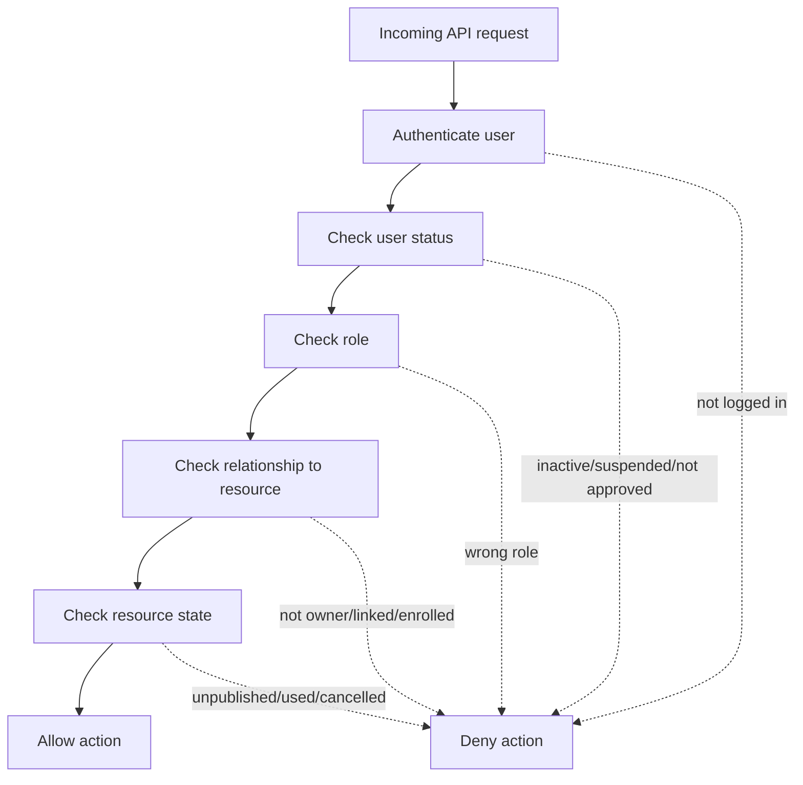

# Step 08 - Authentication and Authorization Design

## 1. Purpose

This step designs how users log in and how the system decides what each user can access.

It answers:

- Who is the user?
- What role does the user have?
- What resource is the user trying to access?
- What relationship does the user have to that resource?
- Is the action allowed?

For this E-learning system, authorization is one of the most important architecture areas.

## 2. Authentication vs Authorization

### Authentication

Authentication answers:

```text
Who are you?
```

Examples:

- Login with phone/email and password
- Validate session or token
- Load current user identity

### Authorization

Authorization answers:

```text
What are you allowed to do?
```

Examples:

- Can this student watch this lesson?
- Can this parent view this student's progress?
- Can this teacher edit this course?
- Can this education center view this teacher's reports?
- Can this admin adjust student balance?

## 3. User Roles

MVP roles:

```text
Student
Parent
Teacher
EducationCenter
Admin
```

Recommended implementation:

Start with one primary role per user because the current documentation describes users that way.

Future option:

If users later need multiple roles, introduce:

```text
UserRoles
Permissions
RolePermissions
```

Do not add that complexity unless the product needs it.

## 4. Authentication Model

### Login Identifier

The documentation mentions name, phone, and email.

Recommended MVP approach:

```text
Use phone or email as login identifier, but choose one primary login method before implementation.
```

Architecture question:

```text
Will Egyptian students commonly use phone numbers, emails, or both?
```

### Session Strategy

Two common options:

1. Cookie-based session
2. JWT access token

For a web-first MVP, a secure HTTP-only cookie session is often simpler and safer.

Recommended:

```text
Use secure HTTP-only cookies for the browser web app.
```

Why:

- Less token handling in frontend code
- Lower risk of token theft through JavaScript
- Good fit for same-domain web applications

If frontend and backend are on separate domains, configure:

- HTTPS
- Secure cookies
- SameSite policy
- CORS carefully

## 5. User Status and Approval

Users should have status fields because not every account can act immediately.

Suggested statuses:

```text
Active
Inactive
PendingApproval
Rejected
Suspended
```

Examples:

- Student: usually active after registration.
- Parent: usually active after registration.
- Teacher: pending approval until admin approves.
- Education Center: pending approval if center approval is required.
- Admin: created by platform owner/admin process.

Important rule:

Authentication can succeed while authorization still denies actions if the user is not approved or active.

Example:

```text
A teacher may log in, but cannot publish/manage courses until approved.
```

## 6. Authorization Types

### Role-Based Authorization

Checks the user's role.

Examples:

```text
Only Admin can generate prepaid codes.
Only Teacher can create teacher courses.
Only Student can enroll in a course.
```

Role checks are necessary, but not enough.

### Relationship-Based Authorization

Checks the user's relationship to the target data.

Examples:

```text
Parent can view progress only for linked students.
Teacher can edit only own courses.
Education center can view only linked teacher data.
Student can watch only enrolled courses.
```

This system needs relationship-based authorization heavily.

### State-Based Authorization

Checks resource state.

Examples:

```text
Student cannot access unpublished course.
Teacher cannot edit approved course price if business says only admin can.
Used code cannot be redeemed.
Rejected teacher cannot publish courses.
```

## 7. Authorization Policy List

Create named backend policies instead of scattering `if` statements everywhere.

Recommended policies:

```text
CanManageUser
CanApproveTeacher
CanApproveCourse
CanManageCurriculum
CanGeneratePrepaidCode
CanCancelPrepaidCode
CanRedeemCodeForStudent
CanViewStudentBalance
CanAdjustStudentBalance
CanEnrollStudentInCourse
CanAccessCourseContent
CanRequestVideoPlayback
CanSubmitQuizAttempt
CanViewStudentProgress
CanManageTeacherCourse
CanViewTeacherReport
CanViewCenterReport
```

## 8. Permission Matrix

| Action | Student | Parent | Teacher | Education Center | Admin |
| --- | --- | --- | --- | --- | --- |
| Register/login | Yes | Yes | Yes, after account exists | Yes, after account exists | Yes |
| Browse published courses | Yes | Yes | Yes | Yes | Yes |
| Create course | No | No | Own courses | Through linked teachers if supported | Support/Admin |
| Submit course for approval | No | No | Own courses | No direct unless acting through teacher | No |
| Approve course | No | No | No | No | Yes |
| Generate prepaid codes | No | No | No | No | Yes |
| Cancel prepaid codes | No | No | No | No | Yes |
| Redeem prepaid code | For self | For linked student | No | No | Support only if defined |
| View student balance | Own | Linked student | No | No | Yes |
| Adjust student balance | No | No | No | No | Yes |
| Enroll in course | Own account | Not confirmed in MVP | No | No | Support only if defined |
| Watch lesson | Enrolled courses | No | Own course preview | Center-linked course preview if supported | Support |
| Submit quiz | Enrolled courses | No | No | No | Support only if defined |
| View progress | Own | Linked student | Own course students | Linked teacher/course students | All |
| View reports | Own learning only | Linked student only | Own courses | Linked teachers/courses | All |

## 9. Relationship Rules

### Student Access

Student can access:

- Own profile
- Own balance
- Own enrollments
- Own progress
- Enrolled course lessons
- Enrolled course quizzes

Student cannot access:

- Other students' progress
- Unenrolled paid courses
- Unpublished courses
- Teacher/admin management features

### Parent Access

Parent can access:

- Linked student profile summary
- Linked student enrollments
- Linked student progress
- Linked student balance if product allows
- Redeem code for one linked student

Parent cannot access:

- Unlinked students
- Teacher/course management
- Admin reports
- Student video playback unless explicitly allowed later

### Teacher Access

Teacher can access:

- Own profile
- Own courses
- Own lessons and quizzes
- Reports for own courses
- Progress for students enrolled in own courses

Teacher cannot access:

- Other teachers' course reports
- Prepaid code generation
- Student balance
- Admin approval actions

### Education Center Access

Education center can access:

- Own center profile
- Linked teachers
- Courses owned by linked teachers
- Reports for linked teachers and courses

Education center cannot access:

- Unlinked teachers
- Other centers' data
- Admin prepaid code management
- Platform settings

### Admin Access

Admin can access:

- User management
- Teacher and center approval
- Course approval
- Curriculum management
- Prepaid code management
- Student balance adjustment
- Platform reports
- Audit logs

Admin actions should be audited when sensitive.

## 10. Sensitive Authorization Checks

### Watch Lesson

Required checks:

```text
1. User is authenticated.
2. User role is Student.
3. Student is enrolled in the course.
4. Course is approved/published.
5. Lesson belongs to the course.
```

### Request Video Playback

Required checks:

```text
1. User is authenticated.
2. User is the enrolled student.
3. Lesson belongs to an approved/published course.
4. Enrollment exists and is active.
5. Return short-lived video access only.
```

### Redeem Prepaid Code

Required checks:

```text
1. User is authenticated.
2. User is Student redeeming for self, or Parent redeeming for linked student.
3. Code exists.
4. Code is active.
5. Code has not been redeemed.
6. Target student exists.
```

### Enroll in Course

Required checks:

```text
1. User is authenticated.
2. User is Student enrolling self.
3. Course is approved/published.
4. Student is not already enrolled.
5. Student balance is enough.
```

### View Student Progress

Allowed if:

```text
1. Student views own progress.
2. Parent views linked student progress.
3. Teacher views progress for students in own courses.
4. Center views progress for linked teacher courses.
5. Admin views progress for any student.
```

## 11. Authorization Flow



## 12. Backend Implementation Pattern

Recommended pattern:

```text
Controller -> Use Case -> Authorization Policy -> Domain Logic -> Repository
```

Example:

```text
POST /api/lessons/{lessonId}/playback-access

Controller:
  Receives request.

Use Case:
  Load lesson and course.

Authorization Policy:
  CanRequestVideoPlayback(currentUser, lessonId)

Domain Logic:
  Ensure course is published.
  Ensure enrollment exists.

Integration:
  Request signed URL/token from video provider.
```

## 13. Error Codes

Use clear authorization errors.

Examples:

```text
UNAUTHENTICATED
USER_NOT_ACTIVE
TEACHER_NOT_APPROVED
FORBIDDEN_ROLE
FORBIDDEN_RESOURCE
COURSE_NOT_PUBLISHED
NOT_ENROLLED
PARENT_STUDENT_LINK_REQUIRED
TEACHER_DOES_NOT_OWN_COURSE
CENTER_TEACHER_LINK_REQUIRED
PREPAID_CODE_NOT_ACTIVE
```

Avoid telling attackers too much.

Example:

For some sensitive resources, return:

```text
404 Not Found
```

instead of:

```text
403 Forbidden
```

when confirming existence would leak private information.

## 14. Audit Requirements

Audit these actions:

```text
Teacher approved/rejected
Education center approved/rejected
Course approved/rejected
Course price changed by admin
Prepaid codes generated
Prepaid code cancelled
Prepaid code redeemed
Student balance manually adjusted
Student balance reset
User suspended/activated
```

Audit log should include:

```text
ActorUserId
Action
TargetType
TargetId
Timestamp
Metadata
```

For balance changes, metadata should include:

```text
Amount
Reason
PreviousBalance
NewBalance
ReferenceId
```

## 15. Common Mistakes

| Mistake | Problem |
| --- | --- |
| Only checking user role. | Role alone does not prove ownership or relationship. |
| Trusting frontend hidden buttons. | Users can call APIs directly. |
| Repeating authorization logic manually in every endpoint. | Inconsistent rules and security bugs. |
| Letting teachers query reports without ownership filters. | Data leaks across teachers. |
| Letting parents pass any student ID. | Parent can see another student's data. |
| Returning permanent video URLs after login. | Paid content can be shared. |
| Allowing suspended users to keep using existing sessions. | Account status changes become ineffective. |

## 16. Step 08 Conclusion

This system needs more than simple role-based access control.

It needs:

1. Role-based authorization
2. Relationship-based authorization
3. State-based authorization
4. Audit logs for sensitive actions

The most important authorization relationships are:

- Student owns own learning data.
- Parent links to student.
- Teacher owns course.
- Center links to teacher.
- Student enrollment grants paid course access.

The next step is video streaming design.

