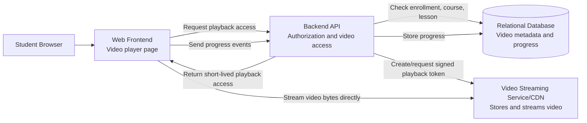
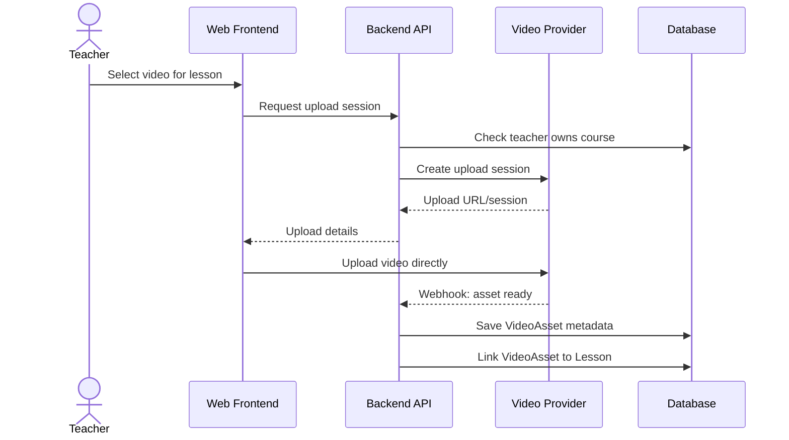
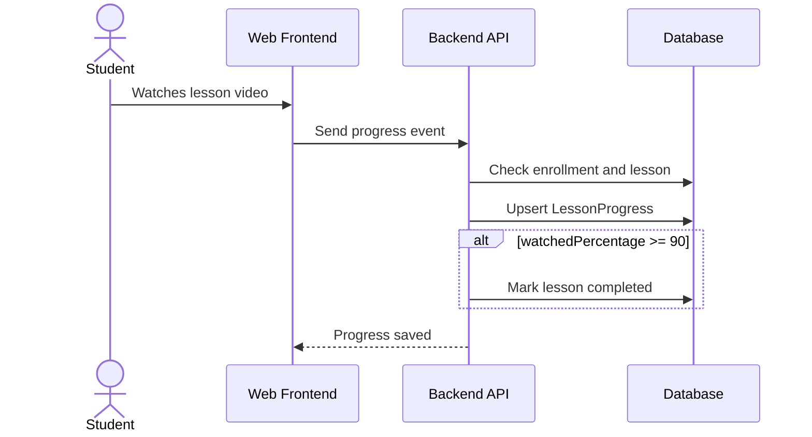

# Step 09 - Video Streaming Design

## 1. Purpose

This step designs how recorded lesson videos should work.

It answers:

- Where are videos stored?
- Who streams the actual video bytes?
- How does the platform decide who can watch?
- How do we reduce direct download risk?
- How does progress tracking work with video playback?

Video is one of the biggest architecture drivers in this system.

## 2. Key Requirements

From the product documentation:

```text
Students can watch enrolled video lessons.
Videos should not be directly downloadable.
Automatic lesson completion happens after watching 90% of the video.
Video playback should be stable for students.
```

Architecture interpretation:

```text
The backend should not stream video files directly.
The backend should authorize playback.
The video provider/CDN should deliver the video.
The system should store video metadata and progress events.
```

## 3. Recommended Architecture

Use an external video streaming service or object storage plus CDN.

Recommended pattern:

```text
Backend owns access decision.
Video provider owns storage and streaming.
Frontend owns playback UI.
```

Do not stream video through the Backend API.

Why:

- Video traffic is heavy.
- Backend servers become expensive and slow if they stream video.
- CDN/video providers are optimized for buffering, range requests, adaptive bitrate, and global delivery.
- The backend should focus on business rules.

## 4. Video Containers



## 5. Video Data Model

### VideoAsset

Stores metadata only.

Suggested fields:

```text
Id
Provider
ProviderAssetId
DurationSeconds
Status
UploadedByUserId
CreatedAt
UpdatedAt
```

### Lesson

References video asset.

Suggested fields:

```text
Id
CourseId
Title
SortOrder
VideoAssetId
CreatedAt
UpdatedAt
```

### LessonProgress

Tracks watching progress.

Suggested fields:

```text
Id
StudentId
LessonId
WatchedPercentage
CurrentSecond
DurationSeconds
IsCompleted
CompletionSource
CompletedAt
UpdatedAt
```

Completion source examples:

```text
Manual
AutomaticVideoWatch
AdminCorrection
```

## 6. Playback Access Flow

```text
1. Student opens lesson page.
2. Frontend calls POST /api/lessons/{lessonId}/playback-access.
3. Backend authenticates current user.
4. Backend checks user is a student.
5. Backend loads lesson and course.
6. Backend checks course is approved and published.
7. Backend checks student is enrolled in the course.
8. Backend requests or generates short-lived playback access from video provider.
9. Backend returns playback URL/token to frontend.
10. Frontend streams video directly from provider.
```

Important:

The playback URL/token should expire quickly.

Example:

```text
Expires in 5 to 30 minutes, depending on provider and player behavior.
```

## 7. Upload Flow

For MVP, teacher adds video content to lessons.

Recommended upload pattern:

```text
1. Teacher creates or edits lesson.
2. Teacher requests upload permission from Backend API.
3. Backend validates teacher owns the course.
4. Backend creates upload session with video provider.
5. Teacher uploads video directly to provider.
6. Provider returns asset ID or sends webhook.
7. Backend stores VideoAsset metadata.
8. Lesson references VideoAsset.
```

Alternative simpler MVP pattern:

```text
Admin/teacher manually uploads video to provider dashboard.
Teacher pastes provider asset ID into the platform.
Backend stores provider asset ID.
```

This is faster for MVP but less polished.

## 8. Upload Flow Diagram



## 9. Progress Tracking Flow

The frontend video player sends progress events.

Endpoint:

```text
POST /api/lessons/{lessonId}/progress-events
```

Request example:

```json
{
  "currentSecond": 690,
  "durationSeconds": 750,
  "watchedPercentage": 92
}
```

Backend checks:

```text
1. User is authenticated.
2. User is a student.
3. Student is enrolled in the course.
4. Lesson belongs to the course.
5. watchedPercentage is valid between 0 and 100.
```

Completion rule:

```text
If watchedPercentage >= 90, mark lesson as completed automatically.
```

## 10. Progress Tracking Diagram



## 11. Direct Download Protection

The requirement says:

```text
Videos should not be directly downloadable.
```

Important architecture note:

No normal web video solution can fully prevent recording or capture. The realistic goal is to reduce easy sharing and direct file download.

Recommended protections:

```text
1. Do not expose permanent public video URLs.
2. Use signed URLs or playback tokens.
3. Use short expiration times.
4. Keep video assets private in the provider.
5. Validate enrollment before issuing playback access.
6. Prefer HLS/DASH streaming over direct MP4 links.
7. Add watermarking later if required, but it is out of MVP scope.
```

Out of scope for MVP:

```text
Advanced video watermarking
Full DRM
Screen recording prevention
```

## 12. Provider Options

This design is provider-neutral.

Possible options:

```text
Vimeo private videos
Cloudflare Stream
AWS S3 + CloudFront signed URLs
Mux
Bunny Stream
Azure Media Services alternative if available in chosen cloud
```

Selection criteria:

```text
1. Supports private playback.
2. Supports signed URLs or tokens.
3. Supports adaptive streaming.
4. Works well in Egypt and target regions.
5. Has reasonable pricing.
6. Supports upload flow or manual asset management.
7. Provides stable player integration.
```

## 13. Backend Responsibilities

Backend should:

```text
1. Store video metadata.
2. Authorize lesson access.
3. Issue short-lived playback access.
4. Receive video provider webhooks if supported.
5. Store lesson progress events.
6. Mark lesson complete after 90% watched.
```

Backend should not:

```text
1. Stream video bytes directly.
2. Store permanent public video URLs.
3. Trust frontend progress without validation.
4. Let users request playback for lessons outside enrollment.
```

## 14. Frontend Responsibilities

Frontend should:

```text
1. Request playback access from backend.
2. Render video player.
3. Send progress events periodically.
4. Send completion event when 90% threshold is reached.
5. Show playback errors clearly.
```

Frontend should not:

```text
1. Store permanent playback URLs.
2. Decide course access by itself.
3. Mark progress complete without backend validation.
```

## 15. Failure Scenarios

| Scenario | Expected Behavior |
| --- | --- |
| Student not enrolled | Backend returns `NOT_ENROLLED` or 404-style forbidden response. |
| Course unpublished | Backend denies playback access. |
| Video provider unavailable | Show user-friendly playback error; log provider failure. |
| Playback token expired | Frontend requests a new playback token. |
| Progress event fails | Frontend retries lightly; backend can accept later progress event. |
| Video upload fails | Lesson remains without ready video asset. |

## 16. Security Risks

| Risk | Protection |
| --- | --- |
| User shares playback URL | Short-lived signed URL/token. |
| User guesses lesson ID | Backend checks enrollment and lesson-course relationship. |
| Teacher accesses another teacher's video | Teacher ownership check. |
| Parent tries to play student video | Deny unless product explicitly allows parent viewing. |
| Public provider asset URL leaks | Keep provider assets private. |
| Fake progress events | Validate enrollment and cap progress values. |

## 17. Performance Notes

Video performance should be handled mainly by the provider/CDN.

Backend performance concerns:

```text
1. Playback access endpoint should be fast.
2. Progress events may become frequent, so do not send every second.
3. Store progress using upsert to avoid duplicate records.
4. Consider throttling or batching progress events.
5. Index LessonProgress by StudentId and LessonId.
```

Suggested progress event frequency:

```text
Every 15 to 30 seconds, plus on pause/end.
```

## 18. Architecture Decisions

### Decision 1 - Externalize Video Delivery

Use external video provider/CDN for actual playback.

Reason:

Backend should not carry video bandwidth.

### Decision 2 - Store Metadata, Not Public URLs

Store provider asset ID and status.

Reason:

Permanent URLs create content leakage risk.

### Decision 3 - Backend Issues Playback Access

Student must ask the backend before playing video.

Reason:

Backend owns enrollment and course access rules.

### Decision 4 - Progress is Backend-Validated

Frontend reports progress, backend validates and stores it.

Reason:

Progress affects learning state and reports.

## 19. Common Mistakes

| Mistake | Problem |
| --- | --- |
| Store videos on the backend server. | Expensive, hard to scale, poor playback. |
| Return permanent MP4 links. | Easy to share and download. |
| Let frontend decide if student is enrolled. | API can be bypassed. |
| Send progress event every second. | Creates unnecessary backend load. |
| Mark lesson complete only in frontend state. | Progress is lost or easy to fake. |
| Ignore provider webhook states. | Users may see lessons with unready videos. |

## 20. Step 09 Conclusion

The video architecture should be:

```text
Frontend requests playback access.
Backend checks enrollment and course state.
Video provider streams the video.
Frontend sends progress events.
Backend stores validated progress.
```

This keeps the backend focused on business rules and avoids turning it into a video server.

The next step is prepaid code and balance flow design.

