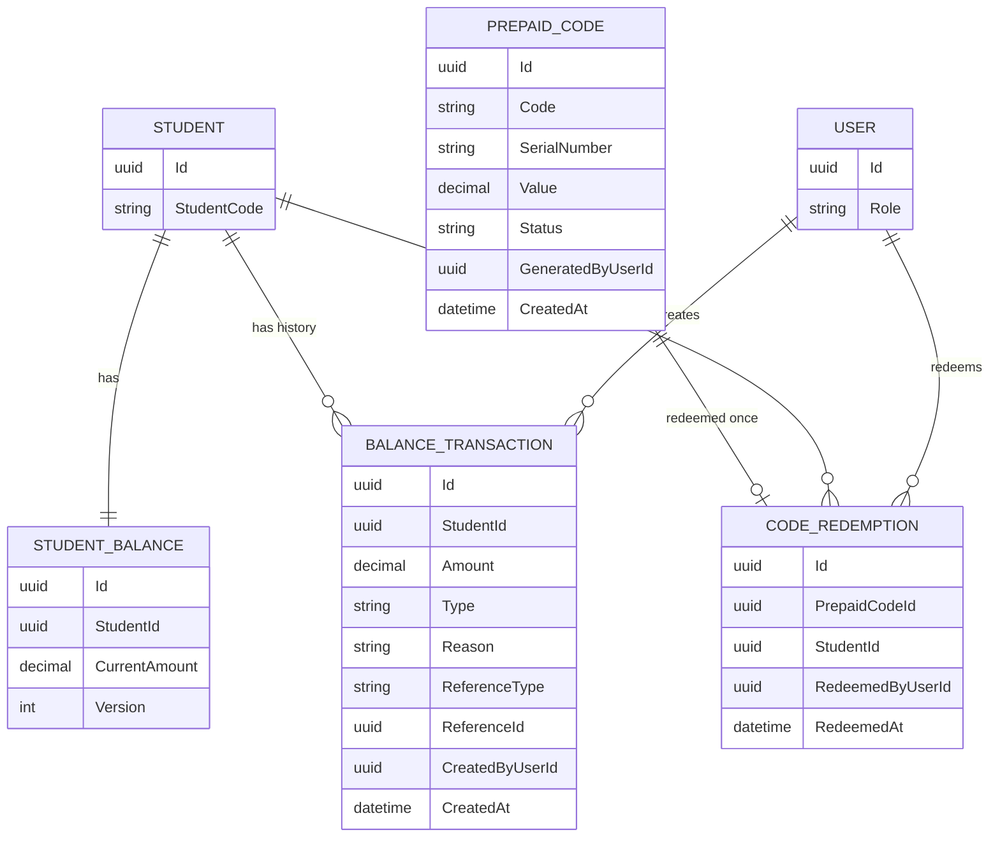
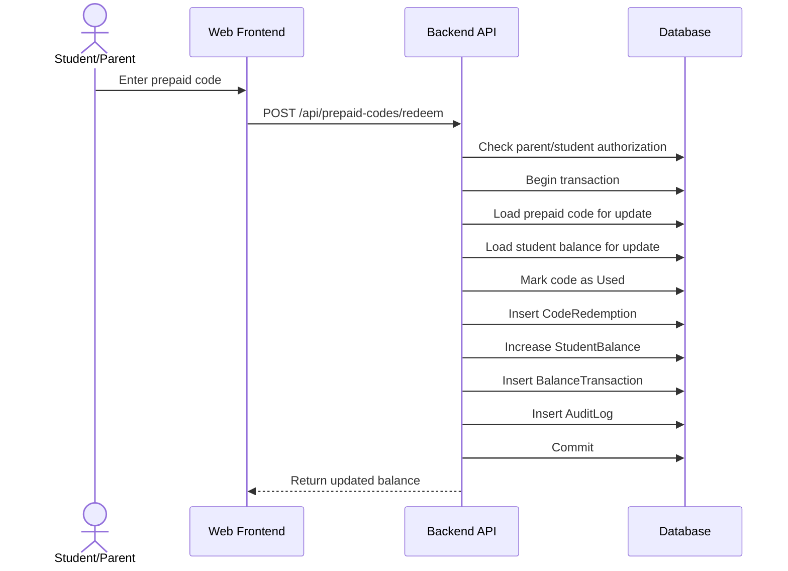
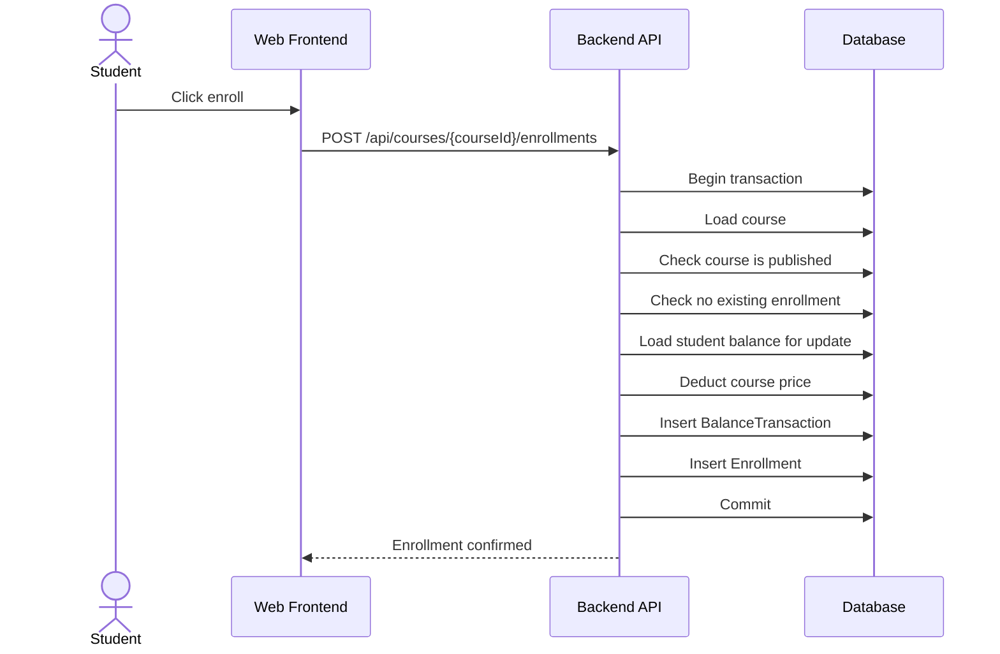

# Step 10 - Prepaid Code and Balance Flow Design

## 1. Purpose

This step designs the prepaid code and student balance system.

It answers:

- How are prepaid codes generated?
- How are codes redeemed?
- How is student balance updated?
- How does balance pay for course enrollment?
- How do we prevent duplicate redemption and negative balance?
- How do we audit money-like operations?

This is one of the highest-risk areas of the MVP.

## 2. Key Requirements

From the documentation:

```text
Admin can generate prepaid codes with fixed values.
Admin can set code status: active, used, or cancelled.
Student or parent can redeem a valid prepaid code.
The system must reject invalid, used, or cancelled codes.
The system must store code redemption history.
Each prepaid code can be redeemed for one student only.
Redeemed code value is added to the student's balance.
Student balance can be used partially across multiple courses.
Student balance cannot become negative.
Admin can manually add or subtract student balance.
Admin can reset a student's balance to 0 for manual refund handling.
Prepaid codes do not expire.
Prepaid codes have serial numbers for manual distribution tracking.
```

## 3. Core Concepts

### Prepaid Code

A prepaid code is a manually distributed code with a fixed money value.

Example:

```text
Code: ABC123XYZ
Serial Number: SN-000001
Value: 100 EGP
Status: Active
```

### Student Balance

Current available balance for a student.

Example:

```text
Student: Ahmed
Current Balance: 150 EGP
```

### Balance Transaction

Immutable history record for every balance change.

Example:

```text
Type: Credit
Amount: +100 EGP
Reason: PrepaidCodeRedemption
Reference: Code ABC123XYZ
```

### Code Redemption

A record proving that a code was redeemed for a specific student.

Example:

```text
Code ABC123XYZ redeemed for Student Ahmed by Parent Mona at 2026-06-05 18:00.
```

## 4. Data Model



## 5. Prepaid Code Statuses

Recommended statuses:

```text
Active
Used
Cancelled
```

Rules:

```text
Only Active codes can be redeemed.
Used codes cannot be redeemed.
Cancelled codes cannot be redeemed.
Prepaid codes do not expire in MVP.
```

## 6. Balance Transaction Types

Recommended types:

```text
Credit
Debit
Adjustment
Reset
```

Recommended reasons:

```text
PrepaidCodeRedemption
CourseEnrollment
AdminManualAdd
AdminManualSubtract
AdminRefundReset
Correction
```

Important:

Use signed amounts consistently.

Recommended:

```text
Credit amounts are positive.
Debit amounts are negative.
Adjustment can be positive or negative.
Reset records the negative amount needed to make balance 0.
```

## 7. Code Generation Flow

Actor:

```text
Admin
```

Flow:

```text
1. Admin requests code generation with value and count.
2. Backend validates admin permission.
3. Backend validates value is positive.
4. Backend generates unique code values and serial numbers.
5. Backend stores codes with Active status.
6. Backend writes audit log.
7. Backend returns generated code summary.
```

API:

```text
POST /api/admin/prepaid-codes
```

Request:

```json
{
  "value": 100,
  "count": 50
}
```

Important constraints:

```text
PrepaidCodes.Code unique.
PrepaidCodes.SerialNumber unique.
PrepaidCodes.Value > 0.
```

## 8. Code Redemption Flow

Actors:

```text
Student
Parent
```

Authorization:

```text
Student can redeem for self.
Parent can redeem for linked student.
```

Flow:

```text
1. Student or parent submits code and target student.
2. Backend validates actor is allowed to redeem for this student.
3. Backend starts database transaction.
4. Backend loads prepaid code with write lock.
5. Backend verifies code exists and is Active.
6. Backend loads student balance with write lock.
7. Backend marks prepaid code as Used.
8. Backend creates CodeRedemption record.
9. Backend increases StudentBalance.CurrentAmount by code value.
10. Backend creates BalanceTransaction credit record.
11. Backend writes audit log.
12. Backend commits transaction.
```

Sequence:



## 9. Course Purchase Using Balance

Actor:

```text
Student
```

Flow:

```text
1. Student selects course enrollment.
2. Backend validates student identity.
3. Backend starts database transaction.
4. Backend loads course.
5. Backend validates course is approved and published.
6. Backend checks student is not already enrolled.
7. Backend loads student balance with write lock.
8. Backend validates balance is enough.
9. Backend deducts course price from balance.
10. Backend creates BalanceTransaction debit record.
11. Backend creates Enrollment record.
12. Backend writes audit log or purchase history.
13. Backend commits transaction.
```

Sequence:



## 10. Admin Manual Balance Adjustment

Actor:

```text
Admin
```

Flow:

```text
1. Admin enters student, amount, and reason.
2. Backend validates admin permission.
3. Backend validates reason is provided.
4. Backend starts transaction.
5. Backend loads student balance with write lock.
6. Backend applies adjustment.
7. Backend prevents negative balance.
8. Backend creates BalanceTransaction.
9. Backend writes audit log with previous and new balance.
10. Backend commits transaction.
```

API:

```text
POST /api/admin/students/{studentId}/balance-adjustments
```

Request:

```json
{
  "amount": -25,
  "reason": "Manual correction after support case."
}
```

Rules:

```text
Reason is required.
Balance cannot become negative.
Audit log is required.
```

## 11. Manual Refund Reset

Current business rule:

```text
Refunds are handled manually outside the system.
Admin resets student balance to 0 and money is returned manually.
Refund is allowed only if the student has not used/bought a course.
No refund is allowed after the student buys a course and watches lessons.
```

Recommended flow:

```text
1. Admin selects student balance reset.
2. Backend checks admin permission.
3. Backend checks refund eligibility rule if implemented.
4. Backend requires reason.
5. Backend starts transaction.
6. Backend loads balance with write lock.
7. Backend creates reset transaction for negative current balance.
8. Backend sets current balance to 0.
9. Backend writes audit log.
10. Backend commits transaction.
```

Important open question:

```text
Should the system enforce refund eligibility automatically, or should admin be responsible for checking it manually?
```

Architect recommendation:

At minimum, show warning and audit reason. Ideally, enforce the rule using enrollment/watch history.

## 12. Transaction Boundaries

### Must Be Transactional

```text
Code redemption
Course enrollment purchase
Manual balance adjustment
Balance reset
Code cancellation
```

### Can Be Non-Transactional or Async

```text
Future notification after code redemption
Future notification after enrollment
Report refresh
Export generation
```

Important:

Do not make balance correctness depend on async jobs.

## 13. Duplicate Protection

### Duplicate Code Redemption

Protect with:

```text
1. Transaction.
2. Write lock or concurrency token on PrepaidCode.
3. Unique constraint on CodeRedemptions.PrepaidCodeId.
4. Code status check inside the transaction.
```

### Duplicate Course Enrollment

Protect with:

```text
1. Transaction.
2. Unique constraint on Enrollments.StudentId + CourseId.
3. Check existing enrollment inside transaction.
```

### Double Click or Retry

If frontend sends same request twice:

```text
Code redemption should fail second time because code is Used.
Enrollment should fail or return already enrolled because unique enrollment exists.
```

Optional future improvement:

```text
Idempotency-Key header for sensitive POST requests.
```

## 14. Error Cases

| Scenario | Error Code |
| --- | --- |
| Code does not exist | `INVALID_PREPAID_CODE` |
| Code is already used | `PREPAID_CODE_ALREADY_USED` |
| Code is cancelled | `PREPAID_CODE_CANCELLED` |
| Parent tries unlinked student | `PARENT_STUDENT_LINK_REQUIRED` |
| Balance not enough for course | `INSUFFICIENT_BALANCE` |
| Course not published | `COURSE_NOT_AVAILABLE` |
| Student already enrolled | `ALREADY_ENROLLED` |
| Manual adjustment makes balance negative | `BALANCE_CANNOT_BE_NEGATIVE` |
| Admin adjustment missing reason | `BALANCE_ADJUSTMENT_REASON_REQUIRED` |

## 15. Audit Requirements

Audit these events:

```text
Prepaid codes generated
Prepaid code cancelled
Prepaid code redeemed
Student balance credited by code
Student balance debited by enrollment
Admin manual balance add/subtract
Admin balance reset
```

Audit fields:

```text
ActorUserId
Action
TargetType
TargetId
Timestamp
Metadata
```

For balance changes, metadata should include:

```text
StudentId
PreviousBalance
ChangeAmount
NewBalance
Reason
ReferenceType
ReferenceId
```

## 16. Reporting Needs

This flow feeds reports:

```text
Prepaid code report
Code redemption report
Student balance history
Teacher sales report
Course enrollment report
Manual adjustment report
```

For teacher sales:

```text
Use Enrollment.PurchaseAmount and Course.TeacherId.
```

Do not calculate sales only from current course price because price may change later.

## 17. Important Design Decision

### Store Purchase Amount on Enrollment

When a student enrolls, store:

```text
Enrollment.PurchaseAmount
```

Reason:

Course price may change later. Historical sales reports need the price paid at purchase time, not the current course price.

## 18. Common Mistakes

| Mistake | Problem |
| --- | --- |
| Only storing current balance. | Cannot audit or explain money-like changes. |
| No unique redemption constraint. | Same code may be redeemed twice in race conditions. |
| No transaction around enrollment. | Student may lose balance or get free access. |
| Calculating teacher sales from current course price. | Historical reports become wrong after price changes. |
| Letting admin adjust balance without reason. | Support and audit become weak. |
| Making code redemption async. | Balance may not update reliably or immediately. |
| Allowing negative balance temporarily. | Creates support and trust issues. |

## 19. Architecture Decisions

### Decision 1 - Balance Ledger Is Required

Use `BalanceTransactions` for every balance change.

Reason:

Money-like operations need traceability.

### Decision 2 - Code Redemption Is Atomic

Code status, redemption history, balance update, balance transaction, and audit log must commit together.

Reason:

Partial updates create serious financial and access bugs.

### Decision 3 - Enrollment Purchase Is Atomic

Balance deduction and enrollment creation must commit together.

Reason:

Student should never lose balance without course access, and should never get course access without payment.

### Decision 4 - Reports Use Historical Purchase Data

Enrollment stores purchase amount.

Reason:

Course price can change after purchase.

## 20. Step 10 Conclusion

The prepaid code and balance system should be treated like a small internal wallet.

The most important rules are:

```text
1. Every balance change has history.
2. Balance cannot become negative.
3. Code redemption is one atomic transaction.
4. Enrollment purchase is one atomic transaction.
5. Duplicate redemption and duplicate enrollment are blocked by database constraints.
6. Admin manual changes require audit logs.
```

The next step is enrollment and course access control design.
