# Step 05 - Code Diagram: Redemption and Enrollment

## 1. Purpose

The Code Diagram is the fourth C4 architecture diagram.

It zooms into implementation-level structure for a specific risky area.

For this E-learning MVP, the best code-level candidate is:

```text
Prepaid code redemption and paid course enrollment
```

Why?

- It affects money-like student balance.
- It controls paid course access.
- It needs database transactions.
- It must prevent duplicate code redemption.
- It must prevent negative balance.
- It must avoid duplicate enrollment.

## 2. Scope of This Code Diagram

This diagram focuses on two use cases:

1. Student or parent redeems a prepaid code for a student.
2. Student enrolls in a paid course using student balance.

It does not design the whole backend codebase.

## 3. Suggested Code-Level Building Blocks

### Controllers

- `PrepaidCodesController`
- `EnrollmentsController`

Responsibilities:

- Receive HTTP requests.
- Validate request shape.
- Get current user identity.
- Call application use cases.
- Return response.

### Application Use Cases

- `RedeemPrepaidCodeUseCase`
- `EnrollInCourseUseCase`

Responsibilities:

- Orchestrate the full business operation.
- Call authorization policies.
- Load required domain objects.
- Start and commit transactions.
- Call domain methods.
- Save changes.

### Authorization Policies

- `StudentBalanceAccessPolicy`
- `CourseEnrollmentPolicy`

Responsibilities:

- Confirm a student can redeem for self.
- Confirm a parent can redeem only for linked students.
- Confirm a student can enroll only for self.
- Confirm course is available for enrollment.

### Domain Entities

- `PrepaidCode`
- `StudentBalance`
- `BalanceTransaction`
- `Course`
- `Enrollment`

Responsibilities:

- Hold important business state.
- Protect invariants.
- Expose domain methods such as redeem, debit, credit, and enroll.

### Repositories

- `PrepaidCodeRepository`
- `StudentBalanceRepository`
- `CourseRepository`
- `EnrollmentRepository`

Responsibilities:

- Load and save domain entities.
- Hide database query details.
- Support transaction-aware operations.

### Infrastructure

- `UnitOfWork`
- `AuditLogWriter`

Responsibilities:

- Manage database transaction boundary.
- Persist audit records for sensitive actions.

## 4. Code Diagram

```mermaid
classDiagram
    class PrepaidCodesController {
        +redeem(request)
    }

    class EnrollmentsController {
        +enroll(request)
    }

    class RedeemPrepaidCodeUseCase {
        +execute(command)
    }

    class EnrollInCourseUseCase {
        +execute(command)
    }

    class StudentBalanceAccessPolicy {
        +canRedeemForStudent(actorId, studentId)
    }

    class CourseEnrollmentPolicy {
        +canEnroll(actorId, studentId, courseId)
    }

    class PrepaidCode {
        +code
        +value
        +status
        +redeemedByStudentId
        +redeem(studentId)
    }

    class StudentBalance {
        +studentId
        +currentAmount
        +credit(amount, reason)
        +debit(amount, reason)
    }

    class BalanceTransaction {
        +studentId
        +amount
        +type
        +reason
        +createdAt
    }

    class Course {
        +courseId
        +price
        +status
        +isPublished()
    }

    class Enrollment {
        +studentId
        +courseId
        +createdAt
    }

    class PrepaidCodeRepository {
        +getByCodeForUpdate(code)
        +save(prepaidCode)
    }

    class StudentBalanceRepository {
        +getByStudentIdForUpdate(studentId)
        +save(balance)
    }

    class CourseRepository {
        +getById(courseId)
    }

    class EnrollmentRepository {
        +exists(studentId, courseId)
        +add(enrollment)
    }

    class UnitOfWork {
        +beginTransaction()
        +commit()
        +rollback()
    }

    class AuditLogWriter {
        +record(action, actorId, targetId, metadata)
    }

    PrepaidCodesController --> RedeemPrepaidCodeUseCase
    EnrollmentsController --> EnrollInCourseUseCase

    RedeemPrepaidCodeUseCase --> StudentBalanceAccessPolicy
    RedeemPrepaidCodeUseCase --> PrepaidCodeRepository
    RedeemPrepaidCodeUseCase --> StudentBalanceRepository
    RedeemPrepaidCodeUseCase --> UnitOfWork
    RedeemPrepaidCodeUseCase --> AuditLogWriter
    RedeemPrepaidCodeUseCase --> PrepaidCode
    RedeemPrepaidCodeUseCase --> StudentBalance
    StudentBalance --> BalanceTransaction

    EnrollInCourseUseCase --> CourseEnrollmentPolicy
    EnrollInCourseUseCase --> CourseRepository
    EnrollInCourseUseCase --> EnrollmentRepository
    EnrollInCourseUseCase --> StudentBalanceRepository
    EnrollInCourseUseCase --> UnitOfWork
    EnrollInCourseUseCase --> AuditLogWriter
    EnrollInCourseUseCase --> Course
    EnrollInCourseUseCase --> Enrollment
    EnrollInCourseUseCase --> StudentBalance
```



## 5. Redemption Flow

```text
1. User submits prepaid code and target student ID.
2. Controller creates RedeemPrepaidCodeCommand.
3. Use case checks whether actor can redeem for the target student.
4. Transaction starts.
5. Prepaid code is loaded with a write lock.
6. Student balance is loaded with a write lock.
7. Domain validates code is active and unused.
8. Domain marks code as redeemed for this student.
9. Student balance is credited.
10. Balance transaction is created.
11. Redemption history is stored.
12. Audit log is recorded.
13. Transaction commits.
```

## 6. Enrollment Flow

```text
1. Student submits course enrollment request.
2. Controller creates EnrollInCourseCommand.
3. Use case checks actor can enroll as this student.
4. Transaction starts.
5. Course is loaded.
6. Student balance is loaded with a write lock.
7. System checks course is approved and published.
8. System checks student is not already enrolled.
9. System checks balance is enough.
10. Student balance is debited.
11. Balance transaction is created.
12. Enrollment record is inserted.
13. Audit log is recorded.
14. Transaction commits.
```

## 7. Domain Invariants

These rules must be protected by backend/domain/database, not only frontend UI.

### Prepaid Code

```text
1. A cancelled code cannot be redeemed.
2. A used code cannot be redeemed again.
3. A prepaid code can be redeemed for one student only.
4. A redeemed code must have redemption history.
```

### Student Balance

```text
1. Balance cannot become negative.
2. Every balance change must create a balance transaction.
3. Manual admin adjustment must include actor and reason.
4. Balance should be changed only through the Balance component.
```

### Enrollment

```text
1. Student cannot enroll in an unpublished course.
2. Student cannot enroll in the same course twice.
3. Student cannot enroll without enough balance.
4. Enrollment and balance deduction must succeed or fail together.
```

## 8. Database Constraints to Support the Code

Application code is not enough. Important rules should also be protected by database constraints.

Recommended constraints:

```text
PrepaidCodes.Code is unique.
PrepaidCodes.Status is constrained to Active, Used, Cancelled.
PrepaidCodes.RedeemedByStudentId is nullable until used.
PrepaidCodeRedemptions.PrepaidCodeId is unique.
Enrollments has unique StudentId + CourseId.
StudentBalances.CurrentAmount cannot be below zero.
QuizAttempts should allow multiple attempts because quiz retry is allowed in MVP.
```

Recommended transactional behavior:

```text
Load prepaid code with write lock during redemption.
Load student balance with write lock during redemption and enrollment.
Use optimistic concurrency token if write locks are not preferred.
Commit code status, balance update, ledger entry, and audit log together.
```

## 9. Pseudocode: Redeem Prepaid Code

```text
execute(command):
    actor = currentUser()

    if not balanceAccessPolicy.canRedeemForStudent(actor.id, command.studentId):
        reject("Not allowed")

    transaction.begin()

    try:
        code = prepaidCodeRepository.getByCodeForUpdate(command.code)
        if code is null:
            reject("Invalid code")

        balance = studentBalanceRepository.getByStudentIdForUpdate(command.studentId)

        code.redeem(command.studentId)
        balance.credit(code.value, "PrepaidCodeRedemption")

        prepaidCodeRepository.save(code)
        studentBalanceRepository.save(balance)

        auditLogWriter.record("PrepaidCodeRedeemed", actor.id, command.studentId, code.id)

        transaction.commit()
    catch:
        transaction.rollback()
        throw
```

## 10. Pseudocode: Enroll in Course

```text
execute(command):
    actor = currentUser()

    if not enrollmentPolicy.canEnroll(actor.id, command.studentId, command.courseId):
        reject("Not allowed")

    transaction.begin()

    try:
        course = courseRepository.getById(command.courseId)
        if course is null or not course.isPublished():
            reject("Course is not available")

        if enrollmentRepository.exists(command.studentId, command.courseId):
            reject("Already enrolled")

        balance = studentBalanceRepository.getByStudentIdForUpdate(command.studentId)
        balance.debit(course.price, "CourseEnrollment")

        enrollment = Enrollment(command.studentId, command.courseId)
        enrollmentRepository.add(enrollment)
        studentBalanceRepository.save(balance)

        auditLogWriter.record("CourseEnrollmentPurchased", actor.id, command.studentId, course.id)

        transaction.commit()
    catch:
        transaction.rollback()
        throw
```

## 11. Common Mistakes to Avoid

| Mistake | Why It Is Dangerous |
| --- | --- |
| Checking code status, then updating it later without a transaction. | Two users may redeem the same code at the same time. |
| Updating student balance directly from many services. | Balance rules become inconsistent. |
| Creating enrollment before deducting balance. | Student may get access without payment if deduction fails. |
| Deducting balance before creating enrollment without transaction. | Student may lose balance without access if enrollment fails. |
| Relying on frontend to prevent duplicate enrollment. | Users can call backend API directly. |
| Not storing balance transaction history. | Admin cannot audit or explain balance changes. |

## 12. Step 05 Conclusion

The code-level design for redemption and enrollment should protect correctness through:

1. Use cases that orchestrate business operations.
2. Domain methods that protect invariants.
3. Database transactions.
4. Database constraints.
5. Write locks or concurrency tokens.
6. Audit logs.

This completes the core C4 set for the MVP:

1. System Context Diagram
2. Container Diagram
3. Component Diagram
4. Code Diagram for the riskiest flow

The next architecture step should be domain modeling and database design.
